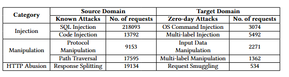

# DAN-detection

A deep learning project for detecting different types of network attacks using transfer learning approaches.

## Overview

This project implements various domain adaptation techniques including:
- MMD (Maximum Mean Discrepancy)
- CMD (Central Moment Discrepancy) 
- SWD (Sliced Wasserstein Distance)
- CORAL (CORrelation ALignment)

## Data Overview

### Dataset Structure

The dataset is organized into Source Domain (Known Attacks) and Target Domain (Zero-day Attacks), comprising three main categories:

#### 1. Injection Attacks
- **Known Attacks:**
    - SQL Injection (218,093 requests): This attack exploits target software that constructs SQL statements based on user input. An attacker crafts input strings so that when the target software constructs SQL statements based on the input, the resulting SQL statement performs actions other than those the application intended. SQL Injection results from failure of the application to appropriately validate input.
    - Code Injection (13,792 requests): An adversary exploits a weakness in input validation on the target to inject new code into that which is currently executing. This differs from code inclusion in that code inclusion involves the addition or replacement of a reference to a code file, which is subsequently loaded by the target and used as part of the code of some application.
- **Zero-day Attacks:**
    - OS Command Injection (3,074 requests): Attackers execute arbitrary operating system commands on a server by exploiting improperly sanitized user inputs, leading to full system compromise.
    - Multi-label Injection (5,492 requests): Multi-lable request that contains injection attack (SQL, Code, OS Command Injection, ...) in their labels

#### 2. Manipulation Attacks
- **Known Attacks:**
    - Protocol Manipulation (9,153 requests): An adversary subverts a communications protocol to perform an attack. This type of attack can allow an adversary to impersonate others, discover sensitive information, control the outcome of a session, or perform other attacks. This type of attack targets invalid assumptions that may be inherent in implementers of the protocol, incorrect implementations of the protocol, or vulnerabilities in the protocol itself.
    - Path Traversal (17,595 requests): An adversary uses path manipulation methods to exploit insufficient input validation of a target to obtain access to data that should be not be retrievable by ordinary well-formed requests. A typical variety of this attack involves specifying a path to a desired file together with dot-dot-slash characters, resulting in the file access API or function traversing out of the intended directory structure and into the root file system. By replacing or modifying the expected path information the access function or API retrieves the file desired by the attacker. These attacks either involve the attacker providing a complete path to a targeted file or using control characters (e.g. path separators (/ or ) and/or dots (.)) to reach desired directories or files.
- **Zero-day Attacks:**
    - Input Data Manipulation (2,271 requests): An attacker exploits a weakness in input validation by controlling the format, structure, and composition of data to an input-processing interface. By supplying input of a non-standard or unexpected form an attacker can adversely impact the security of the target.
    - Multi-label Manipulation (1,362 requests): Similar to multi-label injection, Multi-label request that contains one of the manipulation attacks in their labels.

#### 3. HTTP Abusion Attacks
- **Known Attacks:**
    - Response Splitting (19,134 requests):An adversary manipulates and injects malicious content, in the form of secret unauthorized HTTP responses, into a single HTTP response from a vulnerable or compromised back-end HTTP agent (e.g., web server) or into an already spoofed HTTP response from an adversary controlled domain/site.
- **Zero-day Attacks:**
    - Request Smuggling (534 requests): Attackers craft specially structured HTTP requests that are interpreted differently by front-end and back-end servers, leading to unauthorized actions such as bypassing authentication or injecting malicious payloads.